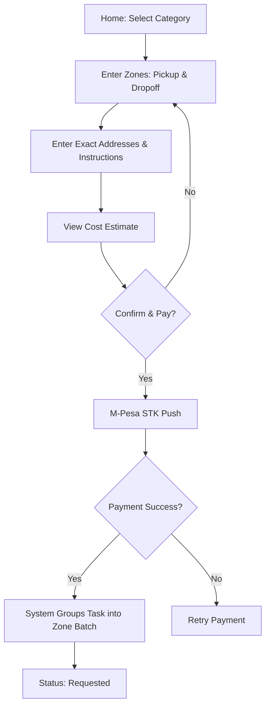
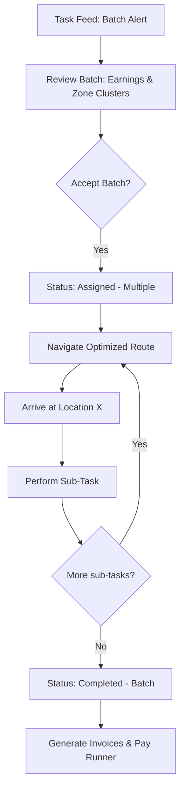

# On The Move Co. - User Flows

## 1. Customer Booking Flow


## 2. Runner Fulfillment Flow


## 3. Order Tracking States
*   **Requested:** Customer paid, waiting for runner.
*   **Assigned:** Runner accepted, moving to start point.
*   **Arrived at Start:** Runner is at the first location.
*   **In-Progress:** Runner is performing the errand (moving to dropoff or waiting in queue).
*   **Completed:** Task done, proof uploaded.
*   **Cancelled:** Task aborted (by customer/runner/admin).
```